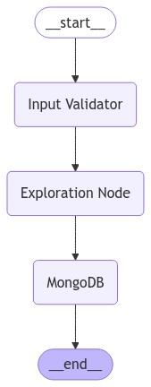

<p align="center">
	
    
  
	
  
  
</p>

# LangGraph Agent for MongoDB

LangGraph is a powerful tool designed to manage the LLM agents by inroducing graph structure between different stages(Nodes) of the pipeline.

This agent helps MongoDB for efficient retrieval in natural language.

The idea is that the user nows the type of information in the DB and instead of using SQL, NoSQL queries, asks agent in natural language, than the agent does the search.

## Results

The agent works perfect with queries in format `Show me smth in the appartment that has something.`

For example:

1. `Input:` <mark>Show me all apartments with 7 bedrooms.</mark> <br>
   `Output:`

```json
[
  {
    "listing_url": "https://www.airbnb.com/rooms/14921505",
    "name": "BEACH ESCAPE",
    "bedrooms": "7"
  },
  ...
  {
    "listing_url": "https://www.airbnb.com/rooms/20955863",
    "name": "Most Beautiful Villa on Bosphorus Istanbul...",
    "bedrooms": "7"
  },
]
```

2. `Input:` <mark>Shom me the summary of property Ribeira Charming Duplex.</mark> <br>
   `Output:`

```json
[
  {
    "name": "Ribeira Charming Duplex",
    "summary": "Fantastic duplex apartment with three bedrooms, located in the historic area of Porto, Ribeira (Cube) - UNESCO World Heritage Site. Centenary building fully rehabilitated, without losing their original character."
  }
]
```

3. `Input:` <mark>How many night minimum can I book at Private Room in Bushwick.</mark> <br>
   `Output:`

```json
[
  {
    "minimum_nights": "14"
  }
]
```

## Structure of the Graph

1. The user asks the question at the `__start__`
2. The question is preprocessed in the `Input Validator`
3. `Exploration Node` creates query to the `MongoDB`
4. The query is executed in the `MongoDB` node.
5. User gets the answer at the `__end__`

<p align="center">
  
</p>

## Few shot prompting

To better understand the expected behavior, while solving the task. I used the few-shot prompting technique which gives the example of question-answering in the prompt. So the final structure that the LLM has is:

```text
You are an assistant for querying the Mongo database based on the user query.
You have a tool binded to you to execute MongoDB queries.
Your task is to generate MongoDB query to answer the user query.

MONGODB SCHEME:
{mongo_scheme}


SAMPLE DOCUMENT:
{sample_doc}


HERE ARE EXAMPLES TO HELP YOU:
{few_shot_query_1}
{few_shot_answer_1}
___
{few_shot_query_2}
{few_shot_answer_2}
___
{few_shot_query_3}
{few_shot_answer_3}
___
{few_shot_query_4}
{few_shot_answer_4}
___
{few_shot_query_5}
{few_shot_answer_5}
___
```

The fewshots are also not fixed. I use Chroma vector store to efficiently retrieve the top 5 most relevant examples for the question. You can read the database of fewshots in the [few shots file](/src/vector_store/few_shots.py).

## The data

The data is just an example of the functionality, it was scraped [here](https://raw.githubusercontent.com/neelabalan/mongodb-sample-dataset/refs/heads/main/sample_airbnb/listingsAndReviews.json).

## Environment variables

`.env`

```python
MONGO_PORT = 27017
MONGO_HOST = localhost

APP_PORT = 1234
MONGO_LOGIN = '' # for example 'root'
MONGO_PASSWORD = '' # for example 'example'
```

`src/.env`

```python
MISTRAL_API_KEY = '' # get yours from mistral webpage
MONGO_PORT = 27017
MONGO_HOST = localhost
MONGO_DB_NAME = "AirBnB"
MONGO_COLLECTION_NAME = "AirBnB"
MONGO_LOGIN = '' # for example 'root'
MONGO_PASSWORD = '' # for example 'example'
```

## API

Run with `docker compose up -d --build` and access http://127.0.0.1:1234/docs


## Installation

```bash
# Clone the repository
git clone https://github.com/DzmitryPihulski/LangGraph-agent-on-MongoDB
cd LangGraph-agent-on-MongoDB

# Run docker network with
docker compose up -d --build
```
